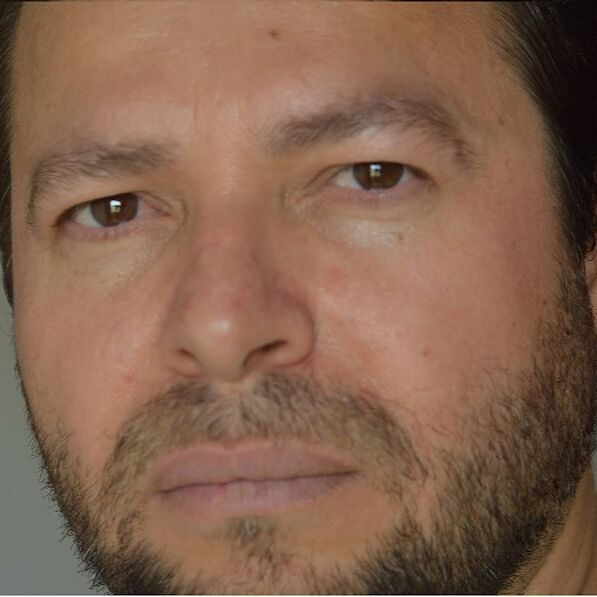

<!--- Logo --->
<link href="https://cdnjs.cloudflare.com/ajax/libs/font-awesome/5.13.0/css/all.min.css" rel="stylesheet">

Jario

<i class="fas fa-phone-alt"></i><a href="//wa.me\5561993367212" title="Whatsapp">+5561993367212</a>

<i class="fas fa-envelope"></i><a href="mailto:jariolog@gmail.com" title="jario@ufmg.br">jario@ufmg.br</a>

<i class="fab fa-twitter-square"></i><a href="https://x.com/jarioswami">@JarioSwami</a>

<!--

<i class="fab fa-linkedin"></i><a href="https://linkedin.com/in/jario">Jario</a>

<i class="fab fa-youtube"></i><a href="https://youtube.com/@jarioswami">@JarioSwami</a>

<i class="fab fa-github"></i><a href="https://github.com/jario">Jario</a>

<i class="fab fa-dev"></i><a href="https://dev.to/jario">Jario</a>
 

--> 

## Interesses

+ *  Yoga,  Meditação
+ *  Gestão Ambiental/Agrícola
+ *  Mecânica. Astronomia, Óptica
  

# Jario 
>> No mundo dos sonhos a ilusão é realidade, neste mundo a realidade é ilusão.

## AbouteMe

`Sobre mim`
__Minha doutrina pessoal__

`Brasília - DF, Brasil`
*Resumo*
+ Jario Swami é o meu nome social[1]. Academicamente, estudei os cursos universitários Bach. Física, Lic. Pedagogia, Gestão Ambiental… e também fiz pós-graduações e cursos técnicos…

Meus livros antigos são cinco publicados pela Editora Ciência Moderna/RJ, sobre informática, e os mais recentes são publicados pela Amazon, um sobre pedagogia holística, o outro sobre Meio Ambiente...

`Crença`
__Religiosidade ou o que restou__

`Sobre tudo`
*Tudo é necessário.*
+ Minha fé inicia e termina no fogo, que é a consciência, a Natureza é meu laboratório.
   

<!--  
//
## Studies

`10/2019 - 09/2023`
__RNCP7: Expert in IT Architecture (RNCP36137)__

`Paris, France`
*42Paris*

+ Discovering of low-level development in C then started to become interested in devops and cybersecurity.
+ A few projects I have done:
  - · Develop my own unix-like Kernel in Rust from scratch
> [<i class="fab fa-github"></i> github.com/Harthann/Yak](https://github.com/Harthann/Yak)
  - · Virus/Keylogger (Unix/Windows) projects (intel asm/C)
> [<i class="fab fa-github"></i> github.com/0x050f/death](https://github.com/0x050f/death) \| [<i class="fab fa-github"></i> github.com/0x050f/tinky-winkey](https://github.com/0x050f/tinky-winkey)
  - · Cryptographic projects (C)
> [<i class="fab fa-github"></i> github.com/0x050f/ft_ssl](https://github.com/0x050f/ft_ssl)
  - · Network projects (C)
> [<i class="fab fa-github"></i> github.com/Harthann/ft_nmap](https://github.com/Harthann/ft_nmap) \| [<i class="fab fa-github"></i> github.com/0x050f/ft_malcolm](https://github.com/0x050f/ft_malcolm)
  - · Reverse engineering and pwned projects
  - · DevOps projects (ansible/docker/kubernetes)
  - · Algorithm projects (python/C++/js)
+ More projects on github !

`2017 - 2018`
__Bachelor's Degree__

`Nancy, France`
*Université de Lorraine*

+ Web/Game projects (php/js), Algorithm projects (Java), and first c++ projects.

`2015 - 2017`
__DUT Informatique__ 

`Nancy, France`
*IUT Nancy-Charlemagne*

+ Discovery of the development world.
+ Web projects, lot of Java projects (Algorithm, network, ...).

//-->

[1]: Sou yogacharya. Usei o meu título de swami com o meu nome de batismo para formar o nome social, e também porque sou Swami Maharaj. 